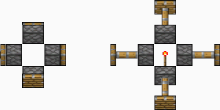

# Redstone Logic

Not official Minecraft product. Not approved by or associated with Mojang or Microsoft.

## redstone dust

a mysterious glowing mineral from a parallel universe. an essential component of all redstone-operated mechanisms.

obtaining:
- small lumps of redstone ore will be generated on new maps
- ground-penetrating scanner will find lumps of buried redstone on existing maps
- trade caravans
- quest rewards
- redstone mining worksites (ideology)

## redstone wire

similar to electric conduit, redstone wire transmits redstone power.
power level drops by 1 for every cell of redstone wire.
thus, redstone wire can transmit power for no more than 15 cells. 

## generators

- **redstone torch** - generates signal of level 15, cannot be moved, never burns out
- **redstone block** - generates signal of level 15, can me moved, can be pushed by pistons
- **lever** - generates signal of level 15 when switched on, cannot be moved

## daylight detector

produces redstone power in proportion to the daylight cycle. can be switched to moonlight mode. is not affected by roofs or artificial light sources.

## tripwire hook

emits a redstone signal when any pawn or item appears between two hooks.
one hook can have up to 4 links.
floor-level buildings, like pressure plates, will not trigger the hook.

## pressure plates

wooden pressure plates can detect all entities.

stone pressure plates can detect only pawns/animals.

golden ("light") detect all entities, and the signal strength equals the number of entities stood on one.

steel ("heavy") is similar to golden, but measures groups of 10 entities.

## tnt

an explosive block with logic pretty similar to minecraft's one.
can be ignited by redstone signal, fire or explosion.
best combined with tripwires or pressure plates :)

## repeater

repeats incoming signal with a configurable 1..250 ticks delay.

## block

just a simple stuffable block that can be pushed by pistons. think of it as a movable wall.

## piston

**piston**:
- pushes any items into an empty cell
- pushes acceptable items into a storage
- breaks any plants/trees, producing harvested resources, if any
- pushes pawns
- if pawns are pushed against the wall, they receive blunt damage
- pushes blocks
- pushes other pistons if they're not extended

**sticky piston**:
- pushes all things similar to a regular one
- pulls blocks / pistons back

by default pistons will not push or pull most of vanilla **buildings**. i've added example support to vanilla torch lamp, campfire and glow pod, which will be just breaked by a piston.

## extending

if building is simple and does not have any caching logic in **postspawn()**, then this should be sufficient:

      <modextensions>
        <li class="redstonelogic.extpistonmoveable"/>
      </modextensions>

if you want building to break when pushed by a piston:

      <modextensions>
        <li class="redstonelogic.extpistonmoveable">
          <breaks>true</breaks>
        </li>
      </modextensions>

if building has some internal logic/caching, and just changing it's position is not sufficient: (true for all storage buildings)

      <modextensions>
        <li class="redstonelogic.extpistonmoveable">
          <respawn>true</respawn>
        </li>
      </modextensions>

## verified compatible/supported mods

- [lwm's deep storage](https://steamcommunity.com/sharedfiles/filedetails/?id=1617282896)
- [blocky signs](https://steamcommunity.com/sharedfiles/filedetails/?id=2985030059)

## you may also like...

https://github.com/zed-0xff/rw-redstonelogic

## support me

 or [patreon](https://www.patreon.com/zed_0xff)
