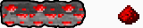

# Redstone Logic

Requires research. Prerequisite: stonecutting.

Not official Minecraft product. Not approved by or associated with Mojang or Microsoft.

## Redstone dust

A mysterious glowing mineral from a parallel universe. An essential component of all redstone-operated mechanisms.

Obtaining:
- small lumps of redstone ore will be generated on new maps
- Ground-penetrating scanner will find lumps of buried redstone on existing maps
- trade caravans
- quest rewards
- redstone mining worksites (Ideology)

## Redstone wire

Similar to electric conduit, redstone wire transmits redstone power.
Power level drops by 1 for every cell of redstone wire.
Thus, redstone wire can transmit power for no more than 15 cells. 

## Generators

- **Redstone Torch** - generates signal of level 15, cannot be moved, never burns out
- **Redstone Block** - generates signal of level 15, can me moved, can be pushed by pistons
- **Lever** - generates signal of level 15 when switched on, cannot be moved

## Daylight Detector

Produces redstone power in proportion to the daylight cycle. Can be switched to moonlight mode. Is not affected by roofs or artificial light sources.

## Tripwire Hook

Emits a redstone signal when any pawn or item appears between two hooks.
One hook can have up to 4 links.
Floor-level buildings, like pressure plates, will not trigger the hook.

## Pressure plates

Wooden pressure plates can detect all entities.

Stone pressure plates can detect only pawns/animals.

Golden ("Light") detect all entities, and the signal strength equals the number of entities stood on one.

Steel ("Heavy") is similar to golden, but measures groups of 10 entities.

## TNT

An explosive block with logic pretty similar to minecraft's one.
Can be ignited by redstone signal, fire or explosion.
Best combined with tripwires or pressure plates :)

## Repeater

Repeats incoming signal with a configurable 1..250 ticks delay.

## Comparator

A redstone comparator is a block that can produce an output signal from its front by reading chests, lecterns, beehives and similar blocks, or repeat a signal without changing its strength. It can also be set to either stop outputting a signal when its side input recieves a stronger one (front torch off), or subtract its side input's signal strength from its output (front torch on).

## Block

Just a simple stuffable block that can be pushed by pistons. Think of it as a movable wall.

## Piston and sticky piston

**Piston**:
- pushes any items into an empty cell
- pushes acceptable items into a storage
- breaks any plants/trees, producing harvested resources, if any
- pushes pawns
- if pawns are pushed against the wall, they receive blunt damage
- pushes blocks
- pushes other pistons if they're not extended

**Sticky piston**:
- pushes all things similar to a regular one
- pulls blocks / pistons back

By default pistons will not push or pull most of vanilla **buildings**. I've added example support to vanilla torch lamp, campfire and
low pod, which will be just breaked by a piston.

## Extending

If building is simple and does not have any caching logic in **postspawn()**, then this should be sufficient:

    <modExtensions>
      <li Class="RedstoneLogic.ExtPistonMoveable"/>
    </modExtensions>

If you want building to break when pushed by a piston:

    <modExtensions>
      <li Class="RedstoneLogic.ExtPistonMoveable">
        <breaks>true</breaks>
      </li>
    </modExtensions>

If building has some internal logic/caching, and just changing it's position is not sufficient: (true for all storage buildings)

    <modExtensions>
      <li Class="RedstoneLogic.ExtPistonMoveable">
        <respawn>true</respawn>
      </li>
    </modExtensions>

## Verified compatible/supported mods

- [LWM's Deep Storage](https://steamcommunity.com/sharedfiles/filedetails/?id=1617282896)
- [Blocky Signs](https://steamcommunity.com/sharedfiles/filedetails/?id=2985030059)

## You may also like...

https://github.com/zed-0xff/RW-RedstoneLogic

## Support me

 or [Patreon](https://www.patreon.com/zed_0xff)
